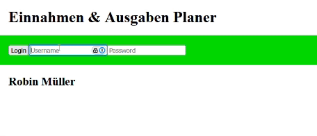

Lern-Periode-7

## Grobplanung

- Ich erstelle einen Vokachabeltrainer mit HTML, CSS und JavaScript

## Feinplanung

### 25.10.2024

Heute habe ich mich entschieden ein Vokabeltrainer mit HTML, CSS und JavaScript zu programmieren. Ich habe den Aufbau und das Design für das Formular, indem man Anworten kann, erstellt. Danach habe ich mit den ersten JavaScript Funktionen gestartet. Allerdings funktionieren sie noch nicht so, wie sie sollten. Aber das Programm kann die Eingabe des Users schon einlesen. (57 Wörter)

### 01.11.2024

- [x] Als Schüler möchte ich im Vokabeltrainer sehen, welches Wort ich übersetzen muss, damit ich es eingeben kann.
  
- [x] Ich möchte als Student im Vokabeltrainer sehen können, ob meine Eingabe richtig oder falsch ist, damit ich weiss, ob ich das Wort nochmals lernen soll.
  
- [ ] ~~Als Englischlernender möchte ich eigene Vokabeln hinzufügen, damit ich mich für meine persönlichen Prüfungen vorbereiten kann.~~
  
- [ ] ~~Ich möchte als Schüler wissen, wieviele Wörter ich in der aktuellen Session schon richtig beantwortet habe, damit ich weiss wie gut ich gearbeitet habe.~~
  
- [x] Als Programierer möchte ich ein 50x50 Grid für das Spielbrett meines Snakegames implementieren.
  
- [x] Als Programmierer möchte ich, dass irgendwo auf dem Feld eine rote Frucht erscheint
  

Heute habe ich meinen Vokabeltrainer zum laufen bekommen. Er zeigt nun die zu übersetzenden Wörter an. Es gibt nun zwei Buttons: Einer fürs Korrigieren und einen fürs Forfahren. Als ich mit dem dritten AP angefangen habe, habe ich gemerkt, dass dieses AP ohne Speichermöglichkeit keinen Sinn macht. Da ich keine Ideen für den Vokabeltrainer mehr hatte, habe ich mit einem neuen hoffentlich etwas längerem Projekt gestartet: Ein Snake Spiel. Zuerst habe ich versucht ein Grid für das Spielbrett zu verwenden, habe aber gemerkt, dass es so zu viel Code gäbe, weshalb ich zu canvas gewechselt habe. Dazu habe ich heute ein Video geschaut. Zum Abschluss implementierte ich eine Snake und eine Frucht, die jedes mal an einem anderen Ort erscheint. (120 Wörter)

### 08.11.2024

- [x] Als Programmierer möchte ich die WASD Eingaben speichern, damit ich später die Schlange bewegen kann.
  
- [x] Als Spieler möchte ich, dass die Schlange die Richtung ändern kann, damit ich die Früchte einsammeln kann.
  
- [ ] Als Programmierer möchte ich die Schlange kontinuierlich fortbewegen, um...
  
- [ ] Als Spieler möchte ich, dass die Schlange stoppt wenn sie am Rand in die Wand schlängelt.
  

Heute habe ich zu erst die Tastatureingaben einlesen lasen. Anschliessend habe ich die Schlange immer, wenn man eine Taste gedrückt hat, ein Feld in die entsprechende Richtung gehen lassen. Danach habe ich noch eine zweite Schlange einprogrammiert, die der ersten Schlange hinterhergeht, damit die Illusion entsteht die erste Schlange bewege sich. Diese zweite Schlange wird am Schluss weiss (jetzt ist sie blau). Als ich mich dann aber am kontinuierlich fortbewegen der Schlange arbeitete, musste ich die Logik mit einem gameloop umstrukturieren, weshalb die zweite Schlange nun nicht mehr der ersten hinterhergeht. Die Schlange und das Script stoppt nun, wenn die Schlange den oberen oder den linken Rand berührt. (108 Wörter.)

### 15.11.2024

--> krank

### 22.11.2024

- [x] Als Schüler löse ich für M294 den Auftrag "8460 - Git" Teilaufgabe 1 und 2 um Git verwenden zu können.
  
- [ ] Als Schüler löse ich für M294 den Auftrag "8460 - Git" Teilaufgabe 3 bis 5 um zu wissen wie man Git verwendet.
  
- [ ] Als Schüler löse ich für M294 den Auftrag "8430 - Client Side Routing Intro".
  
- [ ] Als Schüler löse ich für M294 den Auftrag "8431 - Client Side Routing".
  

Heute konnte ich mich nur mit dem Git Auftrag beschäftigen. Zuerst habe ich die beiden Präsentation zu Git angeschaut. Danach konnte ich die Aufgaben 1 bis 3 schnell und einfach bearbeiten. Doch nach einer Pause begann das Desaster. Zuerst habe ich in Aufgabe 4 den .git-Ordner nicht gefunden. Als ich dann bei Aufgabe 5 war konnte ich einen Link nicht öffnen. Dann habe ich meine Klasse und Frau Rapisarda angeschrieben, weshalb der Link nicht funktioniere. Da niemand anwortete startete ich mit Aufgabe 8430. Nach 30 Minuten bekam ich eine Anwort. Ich versuchte die Hilfestellung umzusetzten, aber es hat trotzdem nicht geklappt. (101 Wörter)

### 29.11.2024

- [x] Ich implementiere die Startseite, die Finanzseite, die Loginseite und die Registrierseite.
  
- [x] Ich implementiere die Überprüfung der Logindaten.
  
- [ ] Ich implementiere die Funktion die Datensätze anzuzeigen und die Funktion einen neuen Eintrag zu erstellen.
  
- [ ] Ich implementiere die Funktion die Datensätze zu löschen und die Funktion einen bestehenden Eintrag zu bearbeiten.
  

Heute habe ich die Loginseite implementiert. Auf der Loginseit kann man sich nun einloggen. Man wird zur Startseite weitergeleitet, wenn man einen Account registriert hat. Das abrufen der Logindaten durch `fetch GET` war sehr aufwendig. Nach langer recherche konnte ich meine Fehler lösen. Anschliessend habe ich mithilfe von DOM Knöpfe erstellt, welche die gewünschten Elemente anzeigen und verschwinden lässt. Dadurch gewährleiste ich die Seite eine SPA ist. Da ich viele Schwierigkeiten bei `fetch GET` konnte ich die letzten APs nicht mehr bearbeiten. (82 Wörter)

**Artefakt:**

### 06.12.2024

- [x] Ich löse das 1. Türchen vom Advent of Code
  
- [ ] Ich löse das 2. Türchen vom Advent of Code
  
- [ ] Ich löse das 3. Türchen vom Advent of Code
  
- [ ] Ich löse das 4. Türchen vom Advent of Code
  

Heute habe ich zum ersten mal am Advent of Code gearbeitet. Zuerst habe ich mir die Beschreibung des 1. Türchens angeschaut. Danach ging ich auf das aoc Reddit, um einen Idee zu bekommen. Dann habe ich `node.js` auf meinen privaten Computer heruntergeladen. Allerdings ist der Download einmal abgestürzt und ich musste ihn wiederholen. Anschliessend habe ich meine Idee umgesetzt. Ich musste sehr viel im Internet recherchieren und habe vieles über `node.js` und `JavaScript` gelernt. (74 Wörter)

### 13.12.2024

- [ ] Als Programmierer möchte ich, dass die blaue Schlange der grünen Schlange hinterher geht, damit es so aussieht als ob sich die Schlange sich fortbewege.
  
- [ ] Als Spieler möchte ich, dass die Schlange stoppt wenn sie am Rand in die Wand schlängelt.
  
- [ ] Schlange stirbt, wenn sie in sich selbst hineinfährt
  

- [ ] Ich löse den 2. Teil des 1. Türchen vom Advent of Code
  

Heute habe ich...
